# AI Agent Identity Protocol (AAIP)
> Complete identity solution for AI agents - verification, authorization, and delegation

[](https://github.com/aaip-protocol/aaip-spec/stargazers)
[](https://opensource.org/licenses/Apache-2.0)
[](docs/identity-adapters.md)

## The Missing Layer in Agent Infrastructure

AI agents need complete identity infrastructure, but current solutions only solve half the problem:

- ✅ **Agent Verification**: "Who is this agent?" *(Partially solved by existing identity systems)*
- ❌ **Authorization & Delegation**: "What can this agent do on my behalf?"

AAIP provides the complete solution - both verification and authorization in one protocol.

## The Solution

AAIP provides complete agent identity infrastructure - combining verification with authorization:

**What existing identity systems give you:**
- Agent verification: "This agent is authentic"
- Basic capabilities: "This agent can browse the web"

**What AAIP adds:**
- User delegation: "I authorize this agent to act for me"
- Scoped permissions: "Only for booking travel, max $2000"
- Time constraints: "Valid for 24 hours only"
- Audit trails: "Show me everything it did"

```python
# Works with your existing agent identity
agent = your_existing_agent  # Any framework, any identity system

# User grants specific authorization via AAIP
delegation = create_aaip_delegation(
    agent_identity=agent.identity,  # Works with any identity format
    scope=["airline.book_flights", "hotel.make_reservations"],
    constraints={"max_spend": "$2000", "trip_dates": "2025-03-15:2025-03-17"},
    expires_in="24_hours"
)

# Agent acts with cryptographic proof of complete identity
result = agent.book_flight("SFO to NYC", delegation)
```

## Complete Identity Infrastructure

AAIP works with any underlying identity system while adding the missing authorization layer:

| Identity System | Status | What It Provides | AAIP Adds |
|----------------|---------|------------------|-----------|
| **Agntcy Identity** | ✅ Supported | Agent verification | User delegation & constraints |
| **Decentralized IDs (DIDs)** | ✅ Supported | Decentralized identity | Authorization & audit trails |
| **OAuth 2.0 / OIDC** | ✅ Supported | Service authentication | Agent-specific permissions |
| **Custom Identity** | ✅ Supported | Your identity format | Standardized authorization |
| **API Keys** | ✅ Supported | Basic auth | Scoped delegations & limits |
| **Enterprise SSO** | 🔄 Coming Soon | Corporate identity | Role-based agent permissions |

## Quick Start with Any Agent Framework

### LangChain Agents
```python
from langchain.agents import create_agent
from aaip import add_authorization_layer

# Your existing LangChain agent
agent = create_agent(llm, tools)

# Add AAIP authorization (works with any identity)
authorized_agent = add_authorization_layer(agent)

# User grants permissions
delegation = user.grant_permissions(
    agent_id=agent.identity,
    scope=["payments.authorize", "calendar.read"],
    constraints={"max_amount": "$500"}
)

# Agent executes with authorization proof
result = authorized_agent.run("book dinner reservation", delegation)
```

### CrewAI Agents
```python
from crewai import Agent
from aaip.integrations.crewai import AAIPCrewAgent

# Your existing CrewAI setup
agent = Agent(role="travel_assistant", tools=[booking_tool])

# Wrap with AAIP authorization
aaip_agent = AAIPCrewAgent(agent)

# Now supports user delegations
delegation = create_delegation(agent.identity, ["travel.book", "payments.charge"])
result = aaip_agent.execute_task(task, delegation)
```

### Custom Agents
```python
from aaip.core import AuthorizedAgent
from aaip.adapters import CustomAdapter

# Your existing agent with any identity system
class MyAgent:
    def __init__(self):
        self.identity = "my-custom-identity-format"
    
    def execute(self, task):
        # Your agent logic
        pass

# Add AAIP authorization
identity_adapter = CustomAdapter(lambda agent: agent.identity)
authorized_agent = AuthorizedAgent(MyAgent(), identity_adapter)

# Now supports delegations with any identity format
delegation = create_delegation(
    identity=authorized_agent.identity,
    scope=["api.call", "data.read"],
    constraints={"rate_limit": "100/hour"}
)
```

## Real-World Use Cases

### Consumer Scenarios
- **Personal Assistant**: Manage calendar, email, and payments with spending limits
- **Travel Agent**: Book flights/hotels across multiple platforms with constraints
- **Shopping Assistant**: Purchase items with brand/price preferences and budgets
- **Healthcare Agent**: Schedule appointments and refill prescriptions safely

### Enterprise Scenarios
- **Workflow Automation**: Agents accessing SaaS tools with role-based permissions
- **Customer Service**: Agents handling tickets with escalation and compliance rules
- **Data Processing**: Agents analyzing sensitive data with privacy constraints
- **DevOps Automation**: Infrastructure management with safety boundaries

## Architecture: Universal Authorization Layer

```mermaid
graph TB
    User[👤 User] --> |Grants Permission| AAIP[🎫 AAIP Delegation]
    
    subgraph "Any Identity System"
        Agntcy[🆔 Agntcy]
        DIDs[🆔 DIDs] 
        OAuth[🆔 OAuth]
        Custom[🆔 Custom]
    end
    
    subgraph "Any Agent Framework"
        LangChain[🦜 LangChain]
        CrewAI[👥 CrewAI]
        CustomAgent[🤖 Custom]
    end
    
    Agent[🤖 Agent] --> |Uses Any| Agntcy
    Agent --> |Uses Any| DIDs
    Agent --> |Uses Any| OAuth
    Agent --> |Uses Any| Custom
    
    Agent --> |Runs On| LangChain
    Agent --> |Runs On| CrewAI  
    Agent --> |Runs On| CustomAgent
    
    Agent --> |Receives| AAIP
    Agent --> |Acts with Both| Service[🏢 Service/API]
    Service --> |Verifies Identity| Agntcy
    Service --> |Validates Authorization| AAIP
    Service --> |Logs Action| Audit[📝 Audit Trail]
```



## Security & Privacy

### Cryptographic Foundation
- **Ed25519 signatures** for delegation verification
- **Time-bounded tokens** prevent replay attacks
- **Scope validation** ensures minimal privilege
- **Audit trails** provide complete accountability

### Privacy Protection
- **Data minimization**: Only necessary information in delegations
- **Selective disclosure**: Users control what agents can access
- **Right to revoke**: Instant permission withdrawal
- **No central authority**: Decentralized verification

### Identity System Independence
- **No identity lock-in**: Switch underlying identity systems without losing authorization capabilities
- **Adapter isolation**: Issues with one identity system don't affect AAIP functionality
- **Forward compatibility**: New identity systems easily integrated
- **Complete solution**: Both verification and authorization in one protocol

## Framework Integrations

### Supported Frameworks
- **LangChain**: Full integration with agents, tools, and chains
- **CrewAI**: Multi-agent authorization with role-based permissions
- **LlamaIndex**: Query engines with data access controls
- **OpenAI Assistants**: Function calling with user-granted permissions
- **Autogen**: Multi-agent conversations with authorization boundaries
- **Custom Frameworks**: Easy integration via adapter pattern

### Integration Examples

#### With Existing Agntcy Agents
```python
from aaip.adapters import AgntcyAdapter

# Your existing Agntcy agent
agntcy_agent = load_agntcy_agent("did:agntcy:123")

# Add AAIP authorization layer
adapter = AgntcyAdapter()
authorized_agent = add_aaip_authorization(agntcy_agent, adapter)

# Now supports user delegations while keeping Agntcy identity
delegation = create_delegation(
    identity=agntcy_agent.identity,
    scope=["payments.authorize"],
    constraints={"max_amount": "$500"}
)
```

#### With DID-Based Agents
```python
from aaip.adapters import DIDAdapter

# Agent with DID identity
did_agent = create_did_agent("did:example:123456")

# Add AAIP authorization
adapter = DIDAdapter()
authorized_agent = add_aaip_authorization(did_agent, adapter)

# Create delegations using DID identity
delegation = create_delegation(
    identity=did_agent.did,
    scope=["calendar.write", "email.send"]
)
```

## Implementation Status

### Core Protocol
- [x] Complete identity specification v1.0 draft
- [x] Identity adapter architecture for any underlying system
- [ ] Reference Python implementation
- [ ] JavaScript SDK
- [ ] Security audit

### Identity System Adapters
- [ ] Agntcy adapter
- [ ] DID adapter
- [ ] OAuth 2.0 adapter
- [ ] Custom identity adapter
- [ ] API key adapter

### Framework Integrations
- [ ] LangChain integration
- [ ] CrewAI integration
- [ ] LlamaIndex support  
- [ ] OpenAI Assistants bridge
- [ ] Autogen integration

### Service Adoptions
- [ ] Demo booking service
- [ ] Demo payment processor
- [ ] Demo SaaS integrations
- [ ] Enterprise pilot programs

## Getting Started

### 1. Install AAIP
```bash
pip install aaip
```

### 2. Choose Your Identity Adapter
```python
# For Agntcy users
from aaip.adapters import AgntcyAdapter
adapter = AgntcyAdapter()

# For DID users  
from aaip.adapters import DIDAdapter
adapter = DIDAdapter()

# For custom identity systems
from aaip.adapters import CustomAdapter
adapter = CustomAdapter(your_identity_resolver)
```

### 3. Add Authorization to Your Agent
```python
from aaip import add_authorization_layer

authorized_agent = add_authorization_layer(your_agent, adapter)
```

### 4. Create User Delegations
```python
delegation = create_delegation(
    identity=authorized_agent.identity,
    scope=["specific.permissions"],
    constraints={"your": "limits"},
    expires_in="1_hour"
)
```

### 5. Execute with Proof
```python
result = authorized_agent.execute(task, delegation)
```

## Contributing

AAIP is designed for maximum ecosystem compatibility and welcomes contributions:

### For Framework Maintainers
- **Add native AAIP support** to your agent framework
- **Contribute adapters** for identity systems you support
- **Join the technical steering committee** for integration decisions

### For Identity System Providers
- **Build AAIP adapters** for your identity standard
- **Provide integration examples** and documentation
- **Help design identity-specific optimizations**

### For Service Providers
- **Add AAIP authorization support** to your APIs
- **Implement delegation verification** in your services
- **Contribute real-world use case examples**

### For Developers
- **Try AAIP** with your existing agents
- **Report compatibility issues** with different frameworks
- **Contribute to SDKs** in your preferred language
- **Build demo applications** showing AAIP capabilities

## Roadmap

### Q3 2025: Foundation
- ✅ Identity-agnostic specification
- 🔄 Core Python implementation
- 🔄 Key identity adapters (Agntcy, DID, OAuth)
- 📅 Framework integrations (LangChain, CrewAI)

### Q4 2025: Ecosystem
- 📅 JavaScript SDK
- 📅 Additional framework support
- 📅 Service provider integrations
- 📅 Developer tools and documentation

### Q1 2026: Enterprise
- 📅 Enterprise identity system support (SAML, AD)
- 📅 Compliance certifications (SOC2, GDPR)
- 📅 Production deployments
- 📅 Performance optimizations

### Q2 2026: Standardization
- 📅 Standards body engagement
- 📅 Industry adoption metrics
- 📅 Cross-platform compatibility testing
- 📅 Next-generation features

## Community & Support

### Development
- **GitHub**: [aaip-protocol/aaip-spec](https://github.com/aaip-protocol/aaip-spec)

### Documentation
- 📖 [Full Specification](spec/core/aaip-v1.0.md)

## License

This project is licensed under the Apache 2.0 License - see the [LICENSE](LICENSE) file for details.

The AAIP specification itself is released under CC0 (public domain) to ensure maximum adoptability across the ecosystem.

## Acknowledgments

- **Agent Framework Maintainers**: LangChain, CrewAI, LlamaIndex and others building the agent ecosystem
- **Identity System Pioneers**: Agntcy, DID Foundation, and OAuth Working Group for showing different approaches to agent identity
- **Security Researchers**: For guidance on cryptographic best practices
- **Early Adopters**: Organizations willing to pilot universal agent authorization

---

*AAIP: Complete identity infrastructure for AI agents - one protocol, every identity system, all frameworks.* 🚀

**Building the complete identity foundation for the agentic future.**
