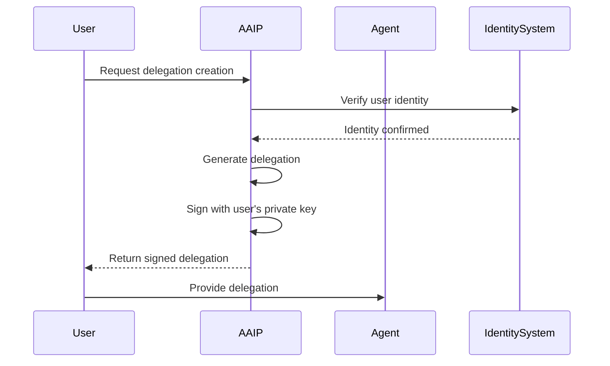
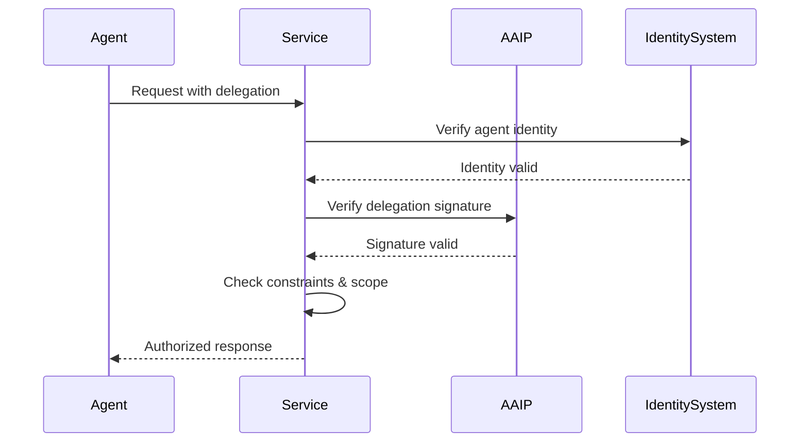
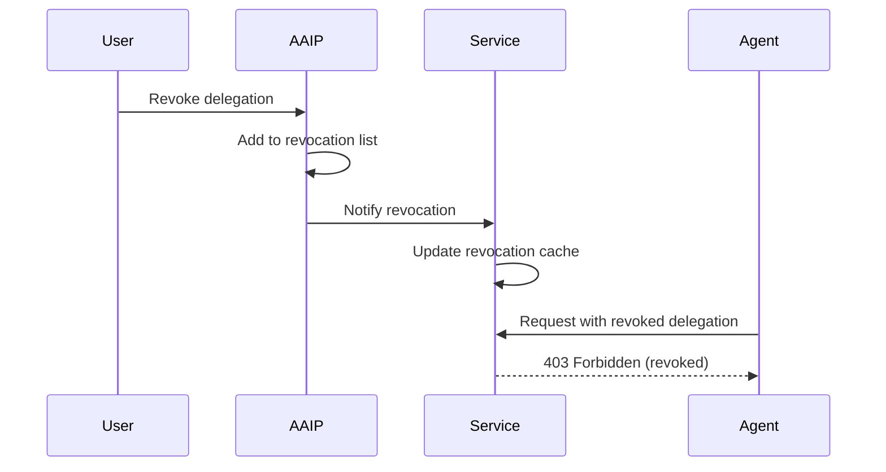

# AI Agent Identity Protocol (AAIP) v1.0 Specification

> Complete identity solution for AI agents - verification, authorization, and delegation

**Status**: Draft  
**Version**: 1.0  
**Date**: July 2025  
**Authors**: AAIP Working Group  

## Abstract

The AI Agent Identity Protocol (AAIP) provides a universal authorization layer for AI agents that works with any underlying identity system. While existing identity solutions solve agent verification ("who is this agent?"), AAIP adds the missing piece: user authorization and delegation ("what can this agent do on my behalf?").

AAIP enables users to grant specific, time-bounded, and constrained permissions to AI agents while maintaining cryptographic proof of authorization and complete audit trails.

## 1. Introduction

### 1.1 Problem Statement

Current AI agent infrastructure has a critical gap:

- &#x2713; **Identity Verification**: Multiple solutions exist (Agntcy, DIDs, OAuth, etc.)
- &#x2717; **Authorization & Delegation**: No standardized way for users to grant specific permissions to agents

This creates security risks, limits agent capabilities, and prevents enterprise adoption.

### 1.2 Solution Overview

AAIP provides a universal authorization layer that:

1. **Works with any identity system** via adapters
2. **Enables user delegation** with cryptographic proof
3. **Supports fine-grained permissions** and constraints
4. **Provides audit trails** for accountability
5. **Maintains security** through time-bounded tokens and minimal privilege

### 1.3 Design Principles

- **Identity System Agnostic**: Works with any underlying identity (DIDs, OAuth, custom, etc.)
- **Cryptographically Secure**: Ed25519 signatures and verifiable delegations
- **Minimal Privilege**: Scoped permissions with explicit constraints
- **Time-Bounded**: All delegations have expiration times
- **Auditable**: Complete trail of authorizations and actions
- **Revocable**: Users can instantly withdraw permissions

## 2. Core Concepts

### 2.1 Entities

#### 2.1.1 User
- Human or organization granting permissions
- Controls delegation creation and revocation
- May use any identity system for authentication

#### 2.1.2 Agent
- AI system acting on behalf of users
- Has an identity from any supported identity system
- Presents delegations when accessing services

#### 2.1.3 Service
- API, platform, or system that agents interact with
- Validates both agent identity and AAIP delegations
- Enforces authorization constraints

#### 2.1.4 Identity Adapter
- Bridge between AAIP and specific identity systems
- Standardizes identity verification across systems
- Enables AAIP to work with any identity format

### 2.2 Key Concepts

#### 2.2.1 Delegation
A cryptographically signed authorization token that grants specific permissions to an agent for a limited time with explicit constraints.

#### 2.2.2 Scope
Hierarchical permission identifiers (e.g., `payments:authorize`, `calendar:read`) that define what actions an agent can perform.

#### 2.2.3 Constraints
Additional limitations on delegations (e.g., spending limits, time windows, data filters) that services must enforce.

#### 2.2.4 Audit Trail
Immutable record of delegation creation, usage, and revocation for accountability and compliance.

## 3. Delegation Format

### 3.1 Structure

```json
{
  "aaip_version": "1.0",
  "delegation": {
    "id": "del_01H8QK9J2M3N4P5Q6R7S8T9V0W",
    "issuer": {
      "id": "user@example.com",
      "type": "oauth",
      "public_key": "ed25519-public-key-hex"
    },
    "subject": {
      "id": "agent-uuid-123",
      "type": "custom"
    },
    "scope": [
      "payments:send",
      "data:read:*",
      "email:send"
    ],
    "constraints": {
      "max_amount": {"value": 500, "currency": "USD"},
      "time_window": {
        "start": "2025-07-23T10:00:00Z",
        "end": "2025-07-24T10:00:00Z"
      },
      "allowed_domains": ["company.com", "*.partner.com"],
      "blocked_keywords": ["urgent", "limited time"]
    },
    "issued_at": "2025-07-23T10:00:00Z",
    "expires_at": "2025-07-24T10:00:00Z",
    "not_before": "2025-07-23T10:00:00Z"
  },
  "signature": "ed25519-signature-hex"
}
```

### 3.2 Field Definitions

#### 3.2.1 Header Fields
- `aaip_version`: Protocol version (currently "1.0")

#### 3.2.2 Delegation Fields
- `id`: Unique delegation identifier (prefixed with `del_`)
- `issuer`: User granting the delegation
  - `id`: User's identity string (format depends on identity type)
  - `type`: Identity system type (`oauth`, `did`, `custom`, etc.)
  - `public_key`: Ed25519 public key for signature verification
- `subject`: Agent receiving the delegation
  - `id`: Agent's identity string (format depends on identity type)
  - `type`: Identity system type (`oauth`, `did`, `custom`, etc.)
- `scope`: Array of permission identifiers with wildcard support
  - Exact match: `"payments:send"` grants exactly that permission
  - Wildcard match: `"data:read:*"` grants all permissions starting with `data:read:`
  - Full wildcard: `"payments:*"` grants all payment-related permissions
- `constraints`: Optional additional limitations (see Section 4)
- `issued_at`: When delegation was created (ISO 8601)
- `expires_at`: When delegation expires (ISO 8601)
- `not_before`: When delegation becomes valid (ISO 8601)

#### 3.2.3 Signature
Ed25519 signature over the canonical JSON representation of the delegation object.

### 3.3 Canonical Serialization

For signature verification, delegations MUST be serialized using deterministic JSON:

1. Remove all whitespace
2. Sort object keys alphabetically at all levels
3. Use UTF-8 encoding
4. No trailing commas or optional fields

Example canonical form:
```json
{"aaip_version":"1.0","delegation":{"constraints":{"max_amount":{"currency":"USD","value":500}},"expires_at":"2025-07-24T10:00:00Z","id":"del_01H8QK9J2M3N4P5Q6R7S8T9V0W","issued_at":"2025-07-23T10:00:00Z","issuer":{"id":"user@example.com","public_key":"ed25519-public-key-hex","type":"oauth"},"not_before":"2025-07-23T10:00:00Z","scope":["payments:send","data:read:*"],"subject":{"id":"agent-uuid-123","type":"custom"}}}
```

## 4. Scope System

### 4.1 Scope Format

Scopes use colon notation for hierarchical permissions:

```
service:action:resource
├── payments:send
├── payments:refund  
├── payments:cancel
├── data:read:profile
├── data:read:email
├── data:write:profile
├── email:send
└── calendar:read
```

### 4.2 Wildcard Support

Scopes support wildcard matching using `*`:

```json
{
  "scope": [
    "payments:send",        // Exact permission
    "data:read:*",         // All data read permissions
    "email:*",             // All email permissions
    "*"                    // All permissions (use with caution)
  ]
}
```

**Wildcard Rules:**
- `*` at the end matches anything following the prefix
- `data:read:*` matches `data:read:profile`, `data:read:email`, etc.
- `payments:*` matches `payments:send`, `payments:refund`, etc.
- `*` alone matches all possible scopes

### 4.3 Scope Validation

When validating a requested action against delegation scope:
1. Check for exact match first
2. Check for wildcard matches
3. Grant access if any match is found

## 5. Constraint System

### 5.1 Standard Constraints

All AAIP implementations MUST support these standard constraint types:

#### 5.1.1 Financial Constraints
```json
{
  "max_amount": {
    "value": 1000.00,
    "currency": "USD"
  }
}
```

Limits individual transaction amounts. Currency codes MUST follow ISO 4217.

#### 5.1.2 Time Window Constraints
```json
{
  "time_window": {
    "start": "2025-07-23T09:00:00Z",
    "end": "2025-07-23T17:00:00Z"
  }
}
```

Restricts when delegations can be used. Times MUST be in ISO 8601 format.

#### 5.1.3 Domain Constraints
```json
{
  "allowed_domains": ["company.com", "*.partner.com", "api.*"],
  "blocked_domains": ["competitor.com", "*.malicious.com"]
}
```

Controls which domains agents can interact with. Supports wildcard patterns:
- `*.example.com` - matches all subdomains of example.com
- `example.*` - matches example.com, example.org, etc.

#### 5.1.4 Content Constraints
```json
{
  "blocked_keywords": ["urgent", "limited time", "act now"]
}
```

Prevents agents from using specified keywords in content (case-insensitive matching).

### 5.2 Extended Constraints

Services may implement additional constraints:

```json
{
  "payment_methods": ["card", "bank_transfer"],
  "shipping_regions": ["US", "CA", "GB"],
  "data_classification": ["public", "internal"],
  "acme.com:approval_required": {"manager": "john@acme.com"}
}
```

**Constraint Types:**
- **Standard constraints** (Section 4.1): All implementations MUST support
- **Extended constraints** (no namespace): Industry-specific, implementations MAY support  
- **Proprietary constraints** (with namespace): Organization-specific

### 5.3 Constraint Validation

Services MUST validate constraints before executing agent requests:
1. Standard constraints MUST be enforced
2. Extended/proprietary constraints MAY be enforced
3. Unknown constraints are ignored
4. Constraint violations MUST reject the request

## 6. Identity Format

### 6.1 Identity String Format

AAIP uses simple string identifiers for both users and agents:

- **OAuth/Email**: `"user@example.com"`
- **DID**: `"did:example:123456"`  
- **Custom**: Any string identifier

### 6.2 Self-Contained Verification

AAIP delegations include the issuer's public key directly:

```json
{
  "issuer": {
    "id": "user@example.com",
    "type": "oauth", 
    "public_key": "ed25519-public-key-hex"
  }
}
```

### 6.3 Identity Validation

```python
def validate_identity_format(identity: str, identity_type: str) -> bool:
    if not identity or not isinstance(identity, str):
        return False

    if identity_type == "did":
        return identity.startswith("did:")
    elif identity_type == "oauth":
        return "@" in identity
    elif identity_type == "custom":
        return len(identity) > 0
    else:
        return True
```

## 7. Cryptographic Security

### 7.1 Signature Algorithm

AAIP uses Ed25519 for all signatures:
- **Public Key**: 32 bytes
- **Private Key**: 32 bytes  
- **Signature**: 64 bytes
- **Encoding**: Hexadecimal for JSON representation

### 7.2 Signature Process

1. **Create delegation object** (without signature field)
2. **Serialize to canonical JSON**
3. **Generate Ed25519 signature** over UTF-8 bytes
4. **Add signature field** with hex-encoded signature

### 7.3 Verification Process

1. **Extract delegation object** (remove signature field)
2. **Serialize to canonical JSON**
3. **Verify Ed25519 signature** using issuer's public key
4. **Validate delegation constraints** and expiration

### 7.4 Key Management

- Users **MUST** securely store private keys
- Public keys **MUST** be discoverable via identity systems
- Key rotation **SHOULD** be supported by identity adapters
- Compromised keys **MUST** result in delegation revocation

### 7.5 Security Considerations

- **Replay attacks**: Prevented by unique delegation IDs and expiration times
- **Man-in-the-middle**: Prevented by cryptographic signatures
- **Privilege escalation**: Prevented by explicit scope validation
- **Data integrity**: Ensured by signature verification

## 8. Protocol Flows

### 8.1 Delegation Creation



### 8.2 Agent Authorization



### 8.3 Delegation Revocation



## 9. Error Handling

### 9.1 Error Response Format

```json
{
  "error": {
    "code": "AAIP_ERROR_CODE",
    "message": "Human readable description",
    "details": {
      "delegation_id": "del_01H8QK9J2M3N4P5Q6R7S8T9V0W",
      "constraint_violated": "max_amount",
      "attempted_value": 1500,
      "limit": 1000
    }
  }
}
```

### 9.2 Standard Error Codes

- `INVALID_DELEGATION`: Malformed delegation format
- `SIGNATURE_INVALID`: Cryptographic signature verification failed
- `DELEGATION_EXPIRED`: Delegation past expiration time
- `DELEGATION_NOT_YET_VALID`: Delegation before not_before time
- `DELEGATION_REVOKED`: Delegation has been revoked
- `SCOPE_INSUFFICIENT`: Required permission not granted
- `CONSTRAINT_VIOLATED`: Request violates delegation constraints
- `IDENTITY_VERIFICATION_FAILED`: Agent identity could not be verified
- `RATE_LIMIT_EXCEEDED`: Too many requests within time window

### 9.3 Error Handling Best Practices

- Log all authorization failures for audit
- Provide specific error messages for debugging
- Don't leak sensitive information in error responses
- Implement exponential backoff for rate limiting
- Cache revocation lists to prevent revoked delegation usage

## 10. Implementation Guidelines

### 10.1 For Identity System Providers

1. **Implement AAIP adapter** for your identity format
2. **Provide public key discovery** mechanism
3. **Support delegation metadata** in identity documents
4. **Consider AAIP delegation management** in your tools

### 10.2 For Agent Framework Maintainers

1. **Add AAIP authorization layer** to your framework
2. **Integrate with multiple identity adapters**
3. **Provide delegation management utilities**
4. **Include constraint validation helpers**

### 10.3 For Service Providers

1. **Implement delegation verification** in your APIs
2. **Define clear scope hierarchies** for your services
3. **Enforce all delegation constraints**
4. **Provide audit trails** for delegation usage

### 10.4 For Application Developers

1. **Use existing AAIP libraries** when possible
2. **Follow principle of least privilege** in scope requests
3. **Implement proper error handling**
4. **Respect user privacy** in delegation design
5. **Always specify explicit timestamps** for delegation time bounds
6. **Validate ISO 8601 timestamp formats** before creating delegations

## 11. Compliance and Privacy

### 11.1 GDPR Compliance

- Users retain control over their data through delegation constraints
- Right to be forgotten supported through delegation revocation
- Data minimization achieved through scoped permissions
- Audit trails provide transparency into data usage

### 11.2 Other Regulations

- **CCPA**: User control and transparency through delegations
- **SOX**: Audit trails for financial delegations
- **HIPAA**: Data constraints for healthcare applications
- **PCI DSS**: Payment constraints and secure delegation storage

### 11.3 Privacy Best Practices

- Minimize data in delegation scopes
- Use time-bounded delegations
- Implement delegation revocation
- Audit delegation usage regularly
- Encrypt delegation storage where applicable

## 12. Versioning and Extensions

### 12.1 Version Compatibility

- Major versions indicate breaking changes
- Minor versions add backward-compatible features
- Patch versions fix bugs without breaking changes
- Services MUST support multiple AAIP versions during transitions

### 12.2 Extension Mechanism

Custom fields can be added to delegations using vendor prefixes:

```json
{
  "delegation": {
    "scope": ["payments:authorize"],
    "x-vendor-custom-field": "custom-value",
    "x-another-vendor-extension": {
      "custom": "data"
    }
  }
}
```

### 12.3 Future Considerations

- **Multi-signature delegations**: Multiple users authorizing single agent
- **Delegation chains**: Agents delegating to other agents
- **Zero-knowledge proofs**: Privacy-preserving authorization
- **Quantum-resistant signatures**: Post-quantum cryptography migration

## 13. References

### 13.1 Standards

- [RFC 7515: JSON Web Signature (JWS)](https://tools.ietf.org/html/rfc7515)
- [RFC 8037: CFRG Elliptic Curve Diffie-Hellman (ECDH) and Signatures in JSON Object Signing and Encryption (JOSE)](https://tools.ietf.org/html/rfc8037)
- [W3C Decentralized Identifiers (DIDs) v1.0](https://www.w3.org/TR/did-core/)
- [OAuth 2.0 Authorization Framework](https://tools.ietf.org/html/rfc6749)

### 13.2 Cryptography

- [Ed25519: high-speed high-security signatures](https://ed25519.cr.yp.to/)
- [RFC 8032: Edwards-Curve Digital Signature Algorithm (EdDSA)](https://tools.ietf.org/html/rfc8032)

### 13.3 Related Work

- [UCAN: User Controlled Authorization Networks](https://ucan.xyz/)
- [Macaroons: Cookies with Contextual Caveats](https://research.google/pubs/pub41892/)
- [Object Capability Model](https://en.wikipedia.org/wiki/Object-capability_model)

---

## Appendix A: Complete Examples

### A.1 Simple Payment Authorization

```json
{
  "aaip_version": "1.0",
  "delegation": {
    "id": "del_payment_example_001",
    "issuer": {
      "id": "did:example:user123",
      "type": "did",
      "public_key": "b0a1c2d3e4f5a6b7c8d9e0f1a2b3c4d5e6f7a8b9c0d1e2f3a4b5c6d7e8f9a0b1"
    },
    "subject": {
      "id": "agent_assistant_v2",
      "type": "custom"
    },
    "scope": ["payments:authorize"],
    "constraints": {
      "max_amount": {"value": 100, "currency": "USD"},
      "allowed_domains": ["amazon.com", "uber.com"]
    },
    "issued_at": "2025-07-23T10:00:00Z",
    "expires_at": "2025-07-23T18:00:00Z",
    "not_before": "2025-07-23T10:00:00Z"
  },
  "signature": "a1b2c3d4e5f6a7b8c9d0e1f2a3b4c5d6e7f8a9b0c1d2e3f4a5b6c7d8e9f0a1b2c3d4e5f6a7b8c9d0e1f2a3b4c5d6e7f8a9b0c1d2e3f4a5b6c7d8e9f0a1b2"
}
```

### A.2 Complex Multi-Service Authorization

```json
{
  "aaip_version": "1.0", 
  "delegation": {
    "id": "del_travel_agent_001",
    "issuer": {
      "id": "alice@example.com",
      "type": "oauth",
      "public_key": "c1d2e3f4a5b6c7d8e9f0a1b2c3d4e5f6a7b8c9d0e1f2a3b4c5d6e7f8e9f0a1b2"
    },
    "subject": {
      "id": "did:agntcy:travel_assistant_001",
      "type": "agntcy"
    },
    "scope": [
      "flights:search",
      "flights:book", 
      "hotels:search",
      "hotels:book",
      "payments:authorize",
      "calendar:write"
    ],
    "constraints": {
      "max_amount": {"value": 3000, "currency": "USD"},
      "time_window": {
        "start": "2025-08-15T00:00:00Z",
        "end": "2025-08-25T23:59:59Z"
      },
      "allowed_domains": ["booking.com", "expedia.com", "*.hotels.com"],
      "travel:destinations": ["NYC", "LAX", "CHI"],
      "travel:hotel_rating_min": 3,
      "travel:flight_class": ["economy", "premium_economy"]
    },
    "issued_at": "2025-07-23T14:30:00Z",
    "expires_at": "2025-07-30T23:59:59Z",
    "not_before": "2025-07-23T14:30:00Z"
  },
  "signature": "d2e3f4a5b6c7d8e9f0a1b2c3d4e5f6a7b8c9d0e1f2a3b4c5d6e7f8e9f0a1b2c3d4e5f6a7b8c9d0e1f2a3b4c5d6e7f8e9f0a1b2c3d4e5f6a7b8c9d0e1f2"
}
```

## Appendix B: Reference Implementation Pseudocode

### B.1 Delegation Creation

```python
def create_delegation(
    issuer_identity: str,
    issuer_private_key: str,
    agent_identity: str,
    scope: List[str],
    expires_at: str,
    not_before: str,
    constraints: Dict[str, Any] = None
) -> Dict[str, Any]:
    
    # Validate timestamp formats
    validate_iso8601_timestamp(expires_at)
    validate_iso8601_timestamp(not_before)
    
    now = datetime.utcnow()
    
    delegation = {
        "aaip_version": "1.0",
        "delegation": {
            "id": generate_delegation_id(),
            "issuer": {
                "id": issuer_identity,
                "type": detect_identity_system(issuer_identity),
                "public_key": derive_public_key(issuer_private_key)
            },
            "subject": {
                "id": agent_identity,
                "type": detect_identity_system(agent_identity)
            },
            "scope": scope,
            "constraints": constraints or {},
            "issued_at": now.isoformat() + "Z",
            "expires_at": expires_at,
            "not_before": not_before
        }
    }
    
    canonical_json = serialize_canonical(delegation)
    signature = ed25519_sign(issuer_private_key, canonical_json.encode('utf-8'))
    delegation["signature"] = signature.hex()
    
    return delegation
```

### B.2 Delegation Verification

```python
def verify_delegation(
    delegation: Dict[str, Any],
    identity_adapter: IdentityAdapter
) -> bool:
    
    # Extract signature
    signature_hex = delegation.pop("signature")
    signature = bytes.fromhex(signature_hex)
    
    # Verify delegation format
    if not validate_delegation_format(delegation):
        return False
    
    # Check expiration
    now = datetime.utcnow()
    expires_at = datetime.fromisoformat(delegation["delegation"]["expires_at"].rstrip('Z'))
    not_before = datetime.fromisoformat(delegation["delegation"]["not_before"].rstrip('Z'))
    
    if now >= expires_at or now < not_before:
        return False
    
    # Verify agent identity
    agent_identity = delegation["delegation"]["subject"]["id"]
    if not identity_adapter.verify_identity(agent_identity, {}):
        return False
    
    # Verify issuer signature
    issuer_public_key = delegation["delegation"]["issuer"]["public_key"]
    canonical_json = serialize_canonical(delegation)
    
    return ed25519_verify(
        bytes.fromhex(issuer_public_key),
        canonical_json.encode('utf-8'),
        signature
    )
```

---

*This specification defines AAIP v1.0 - the complete identity solution for AI agents.*
